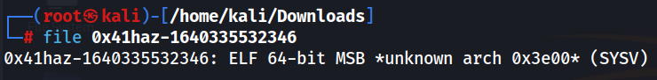
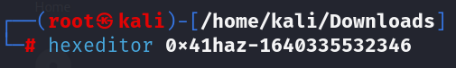
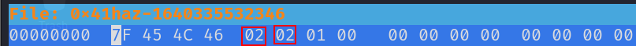
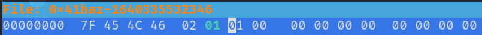
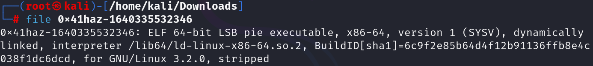
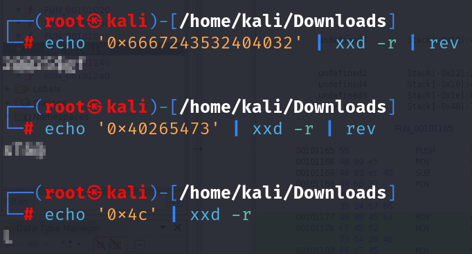
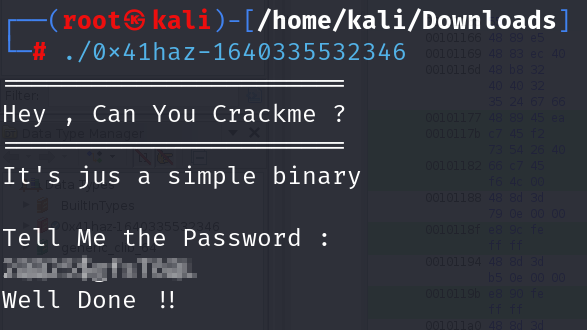

# TRYHACKME - 0x41haz (CTF)


first we need to discover what type of file is this, to discover this we need to do this command

`file 0x41haz-1640335532346`



We can see that the file type suggests – “MSB unknown arch 0x3e00 (SYSV)“. This refers to a Shell Code that has been Obfuscated.

The obfuscation plays with the Linux ELF format. Some bytes in the ELF file header can be changed without changing how the program normally runs. For example, you can make it seem like your executable is 32 bits even though it’s really 64 bits. 

To verify this, we can run this command

`hexeditor 0x41haz-1640335532346`



Now we can verify that it is what we talked about earlier



We can see that the 5th bit is 0x02, denoting that it is a 64-bit file. But the 6th bit seems to be altered.

Now, what can we do?

```
The 5th byte defines format 32 bits (1) or 64 bits (2)
The 6th byte defines endianness LSB (1)  MSB (1)

```

 Changing the 6th bit from 0x02 to 0x01 and saving it will De-obfuscate this



By using the `file` command again, we can see the file type format

`file 0x41haz-1640335532346`



Using the ghidra tool we can finally analyse the binary file

If we search carefully , we can find this peace of code 

```bash
undefined8 FUN_00101165(void)

{
  size_t sVar1;
  char local_48 [42];
  undefined8 local_1e;
  undefined4 local_16;
  undefined2 local_12;
  int local_10;
  int local_c;
  
  local_1e = 0x6667243532404032;
  local_16 = 0x40265473;
  local_12 = 0x4c;
  puts("=======================\nHey , Can You Crackme ?\n=======================");
  puts("It\'s jus a simple binary \n");
  puts("Tell Me the Password :");
  gets(local_48);
  sVar1 = strlen(local_48);
  local_10 = (int)sVar1;
  if ((int)sVar1 != 0xd) {
    puts("Is it correct , I don\'t think so.");
                    /* WARNING: Subroutine does not return */
    exit(0);
  }
  local_c = 0;
  while( true ) {
    if (0xc < local_c) {
      puts("Well Done !!");
      return 0;
    }
    if (*(char *)((long)&local_1e + (long)local_c) != local_48[local_c]) break;
    local_c = local_c + 1;
  }
  puts("Nope");
                    /* WARNING: Subroutine does not return */
  exit(0);
}
```

This code is a login mechanism. In the code exists 3 variables that It appears to be encoded in hexadecimal

If we decode those variables we can get these values from them

 local_1e = 0x6667243532404032

→ fg$52@@2
  local_16 = 0x40265473

→ @&Ts
  local_12 = 0x4c

→ L

But if we combine them into one word, it will fail. Therefore, we will need to try to determine the correct order for this password.

To do this, we can try reverting the strings using this command



Now we merged them and try again

