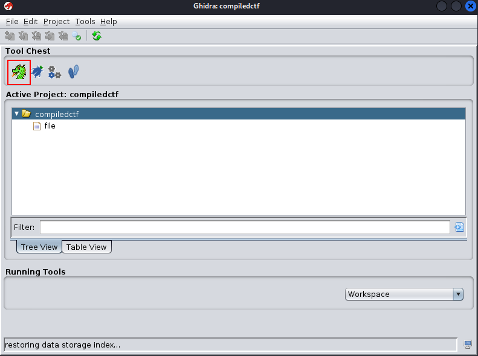
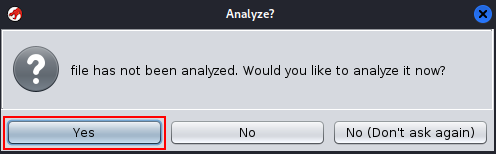
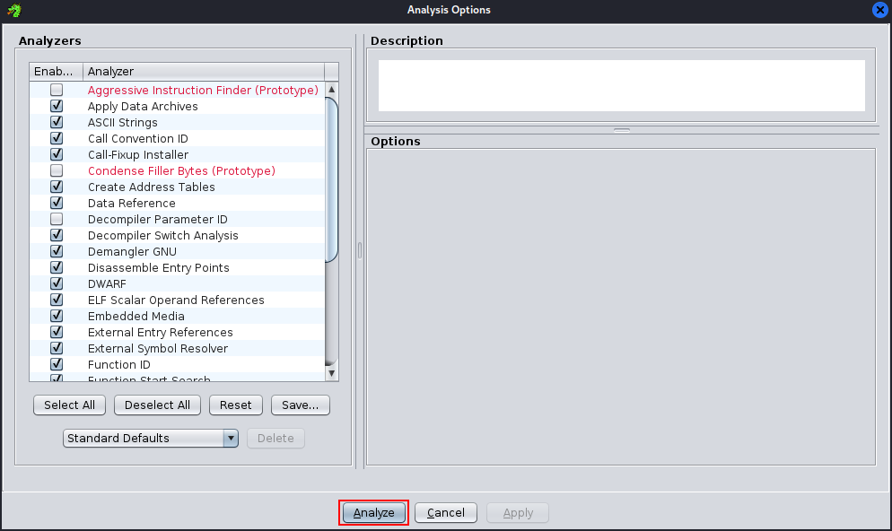
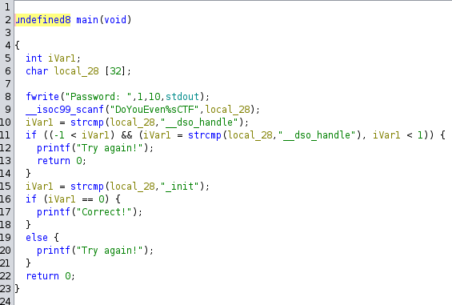
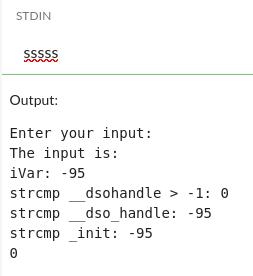
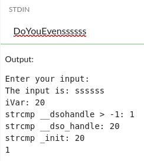
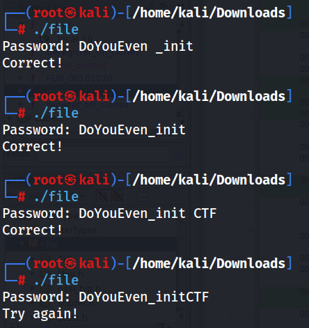

# TRYHACKME - Compiled (CTF)


For this challenge to analyse the binary we need to use a tool called Ghydra…

Ghidra → reverse engineering and binary analysis tool that allows for the disassembly and decompilation of executables, facilitating the understanding of the internal workings of software. It is widely used for security analysis, vulnerability identification, and malware study. 

First, to use ***Ghidra***, we need to create a project and import the binary file. After that, we can click on the Ghidra icon to start analysing the file.







By examining the main function, we can identify the key components of the code that are significant.



```bash
undefined8 main(void)

{
  int iVar1;
  char local_28 [32];
  
  fwrite("Password: ",1,10,stdout);
  __isoc99_scanf("DoYouEven%sCTF",local_28);
  iVar1 = strcmp(local_28,"__dso_handle");
  if ((-1 < iVar1) && (iVar1 = strcmp(local_28,"__dso_handle"), iVar1 < 1)) {
    printf("Try again!");
    return 0;
  }
  iVar1 = strcmp(local_28,"_init");
  if (iVar1 == 0) {
    printf("Correct!");
  }
  else {
    printf("Try again!");
  }
  return 0;
}
```

Prompt the user for a password, which is expected in the format “`DoYouEven%sCTF`”, and then save it in the variable ‘`local_28`’.
Compare the entered password with the string “`__dso_handle`” and store the result in ‘`iVar1`’.
If the password matches “`__dso_handle`”, the program will output “Try again!” and terminate.
Next, compare the password with “`_init`” and again store the result in ‘`iVar1`’.
If the password matches “`_init`”, it indicates that the password is correct

This implies that the valid password is a string that causes ‘`local_28`’ to have the value ‘`_init`’. Understanding this, the next question is how the line ‘`__isoc99_scanf(“DoYouEven%sCTF”, local_28);`’ processes input. To clarify, it captures everything between “`DoYouEven`” and “`CTF`”

To prove it we can do this…






With this information we can conclude that the program accept only if you put the string “`DoYouEven`” first



If we look at the last attempt, we can conclude that the way the program validates our input has rules:

1º The input must start with “`DoYouEven`”

2º The second string must be “`_init`” and not “`_init…`”