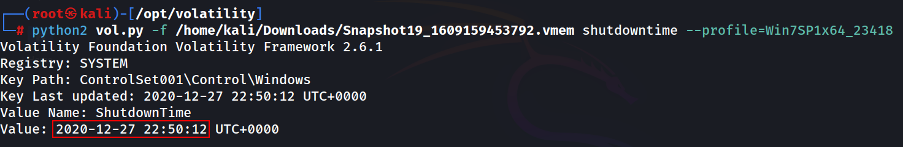

# TRYHACKME - Memory Forensics (CTF)

First of all, we need to install Volatility to analyse the memory dump

### **Volatility3 Installation**

`python3 -m pip install -U git+https://github.com/volatilityfoundation/volatility3.git --break-system-packages`

### **Volatility(2) Installation**

`apt install python2.7` 

`wget [https://bootstrap.pypa.io/pip/2.7/get-pip.py](https://bootstrap.pypa.io/pip/2.7/get-pip.py)`

`python2 [get-pip.py](http://get-pip.py/)`

`cd /opt`

`git clone [https://github.com/volatilityfoundation/volatility.git](https://github.com/volatilityfoundation/volatility.git)`

`cd volatility`

`python2 vol.py`

`python2 [setup.py](http://setup.py) install`

`cd/opt`

`git clone [https://github.com/gdabah/distorm.git](https://github.com/gdabah/distorm.git)
cd distorm3
python [setup.py](http://setup.py/) build
sudo python [setup.py](http://setup.py/) build install`

`sudo apt-get install yara -y
wge thttps://ftp.dlitz.net/pub/dlitz/crypto/pycrypto/pycrypto-2.6.1.tar.gz
tar -xvzf pycrypto-2.6.1.tar.gz
cd pycrypto-2.6.1
python [setup.py](http://setup.py/) build
sudo python [setup.py](http://setup.py/) build install`

`cd /opt/volatility/`

`python2 [vol.py](http://vol.py/) -f /home/kali/Downloads/Snapshot19_1609159453792.vmem shutdowntime --profile=Win7SP1x64_23418`

Basic Command Structure

`python2 vol.py -f <memory_dump> <plugin_name>`

Now we need to discover the operating system

`vol -f /opt/Snapshot6_1609157562389.vmem windows.info`

To extract hashes we can use this command

`vol -f /opt/Snapshot6_1609157562389.vmem windows.hashdump` 

Verify if the hash has been already cracked with [**https://crackstation.net/**](https://crackstation.net/)

Now we have the first flag

For the second flag we need to discover when was the machine last shutdown, and to discover it, we need to use the plugin ***shutdowntime***, but first we need to know the profile that we need to use

`python2 [vol.py](http://vol.py/) -f /home/kali/Downloads/Snapshot19_1609159453792.vmem imageinfo`

`python2 [vol.py](http://vol.py/) -f /home/kali/Downloads/Snapshot19_1609159453792.vmem shutdowntime --profile=Win7SP1x64_23418`

Now we need to know what was done on cmd, but first we need to list the processes to find the cmd pid (Process ID)

`python2 [vol.py](http://vol.py/) -f /home/kali/Downloads/Snapshot19_1609159453792.vmem pslist --profile=Win7SP1x64_23418` 

Once you have the process id (1920), extract/export the information

`python2 [vol.py](http://vol.py) -f /home/kali/Downloads/Snapshot19_1609159453792.vmem memdump -p 1920 -D /home/kali/Documents —profile=Win7SP1x64_23418`

Navigate to the directory where you exported the previous information

`cd /home/kali/Documents`

Use the grep command to search for the flag within the exported information

`strings 1920.dmp | grep THM`

To obtain the final flag, we need to find its corresponding passphrase. To discover we can use an existing plugin called ***truecryptpassphrase*** 

`python2 [vol.py](http://vol.py/) -f /home/kali/Downloads/Snapshot14_1609164553061.vmem truecryptpassphrase --profile=Win7SP1x64_23418`

