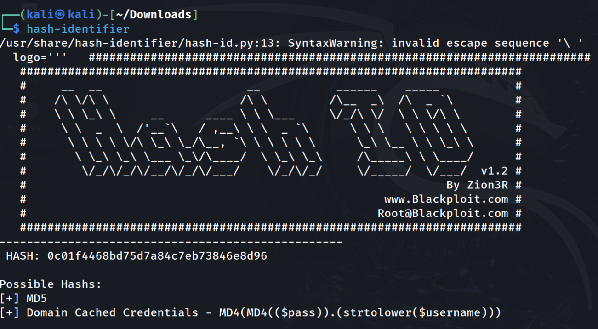
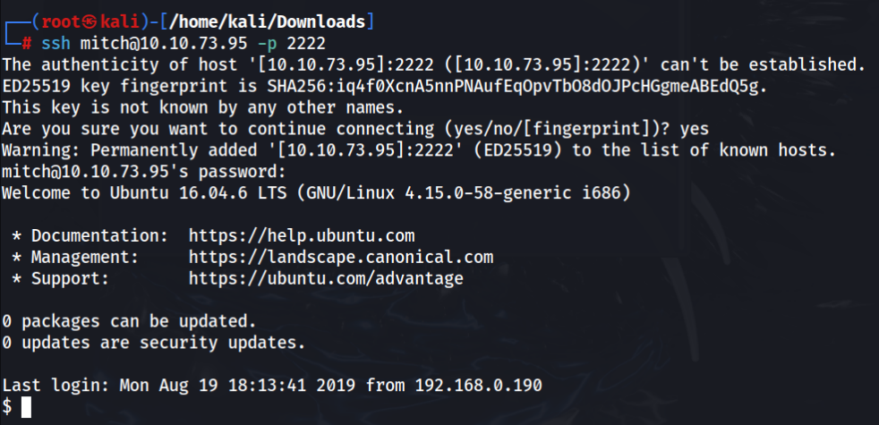

# TRYHACKME - Simple (CTF)

### *How many services are running under port 1000?*

To respond to the first question, we can do a simple port scan  command using nmap

`nmap -T4 10.10.79.77` 

Ans:. 2

### *What is running on the higher port?*

To discover what service is running on the port 2222 (higher port) we can use NetCat tool

`nc -nv 10.10.79.77 2222`

→ n

This option tells Netcat to not perform DNS resolution. It means that it will not attempt to resolve the hostname to an IP address, which can speed up the connection process and avoid potential delays if DNS resolution is slow.

→ v

This option stands for "verbose." It instructs Netcat to provide additional information about what it is doing. This includes details about the connection process, which can be useful for debugging or monitoring.

Ans:. SSH

### *What's the CVE you're using against the application?*

We can't forget about the HTTP port that is open, so through the browser introduce the correct URL

`http://10.10.79.77:80`

This page appears to be a template for creating your own website more easily. Being a template, we just need to search on the internet, and we will find exploits related to this web page model.

Ans:. CVE-2019-9053

### *To what kind of vulnerability is the application vulnerable?*

If we search for this CVE, we discover that it is a SQL injection CVE.

Ans:. SQLi

### *What's the password?*

To discover that, we need to search for the exploit and download it

After that run the exploit with this command

`python2 [46635.py](http://46635.py) -u http://10.10.73.95:80/simple`

As we can see, we discovered a username, email and a hash of a password

Now we need to identify the hash type and crack using hash-identifier and hashcat

Now that we discovered that it is a md5 hash we can elaborate the hashcat command

**`hashcat -a 0 -m 20 hash.txt /usr/share/wordlists/rockyou.txt`**

Ans:. secret

### *Where can you login with the details obtained?*

Now that we know the password and the user, we can try to connect to the machine via ssh

Don’t forget that the ssh port is not the default port (22) 

`ssh mitch@10.10.73.95 -p 2222`

Ans:. ssh

### *What's the user flag?*

For the first flag we just need to read the file

Ans:. G00d j0b, keep up!

### *Is there any other user in the home directory? What's its name?*

`cd ..`

`ls`

Ans:. sunbath

### *What can you leverage to spawn a privileged shell?*

First we need to know if the machine have python, to discover that, we just need to do this command

`which python3`

 After that we can run a pseudo terminal with python to escape from the restricted shell 

`python3 -c 'import pty; pty.spawn("/bin/bash")'`

Now we need to discover what we can run without root privileges

`sudo -l`

Ans:. vim

### *What's the root flag?*

Run the app vim with sudo (use the right path)

put the “!sh” when you are saving the file and it will run

To verify that now we are in root, we can run this command

`id`

As we can see, we are in root and now we have all we need to get the last flag

`cat /root/root.txt`

Ans:. W3ll d0n3. You made it!
