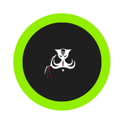
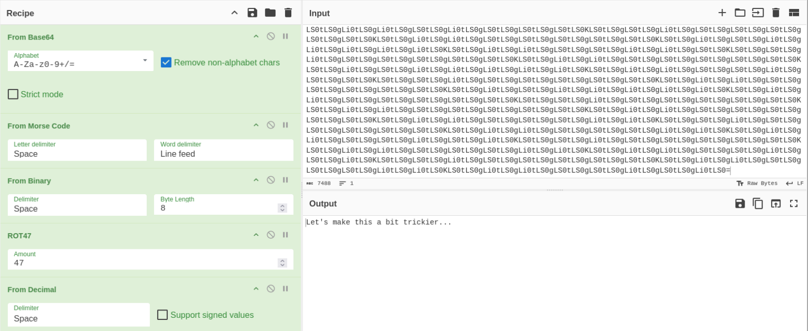
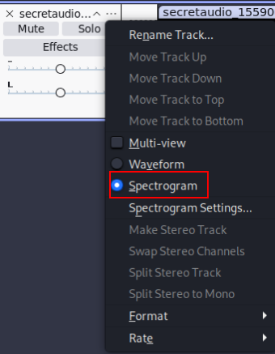
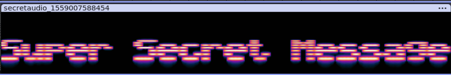
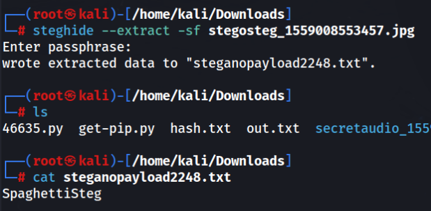
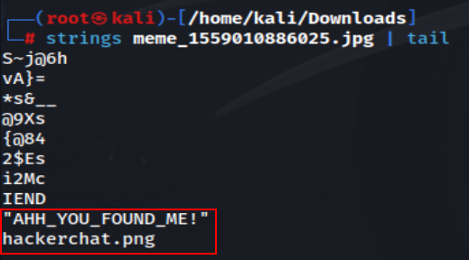

# TRYHACKME - c4ptur3-th3-fl4g (CTF)

## **Translation & Shifting**

### *c4n y0u c4p7u23 7h3 f149?*

Ans:. can you capture the flag (leetspeak)

### *01101100 01100101 01110100 01110011 00100000 01110100 01110010 01111001 00100000 01110011 01101111 01101101 01100101 00100000 01100010 01101001 01101110 01100001 01110010 01111001 00100000 01101111 01110101 01110100 00100001*

Ans:. lets try some binary out! (binary)

### *MJQXGZJTGIQGS4ZAON2XAZLSEBRW63LNN5XCA2LOEBBVIRRHOM======*

Ans:. base32 is super common in CTF's (base32)

### *RWFjaCBCYXNlNjQgZGlnaXQgcmVwcmVzZW50cyBleGFjdGx5IDYgYml0cyBvZiBkYXRhLg==*

Ans:. Each Base64 digit represents exactly 6 bits of data. (base64)

### 68 65 78 61 64 65 63 69 6d 61 6c 20 6f 72 20 62 61 73 65 31 36 3f

Ans:. hexadecimal or base16? (hex)

### Ebgngr zr 13 cynprf!

Ans:. Rotate me 13 places! (rot-13)

### *@F DA:? >6 C:89E C@F?5 323J C:89E C@F?5 Wcf E:>6DX

Ans:. You spin me right round baby right round (47 times) (rot-47)

### *-. .-.. . -.-. --- -- -- ..- -. .. -.-. .- - .. --- -.*

### *. -. -.-. --- -.. .. -. --.*

Ans:. TELECOMMUNICATIONENCODING (Morse Code)

### *85 110 112 97 99 107 32 116 104 105 115 32 66 67 68*

Ans:. Unpack this BCD (Decimal)

### *LS0tLS0gLi0tLS0gLi0tLS0gLS0tLS0g…*

Ans:. Let's make this a bit trickier…

## Spectrograms

Ans:. Super Secret Message

## *Steganography*

Ans:. SpaghettiSteg

## Security through obscurity

## *Download and get 'inside' the file. What is the first filename & extension?*

`strings meme_1559010886025.jpg`

Ans:. hackerchat.png

### *Get inside the archive and inspect the file carefully. Find the hidden text.*

Ans:. AHH_YOU_FOUND_ME!